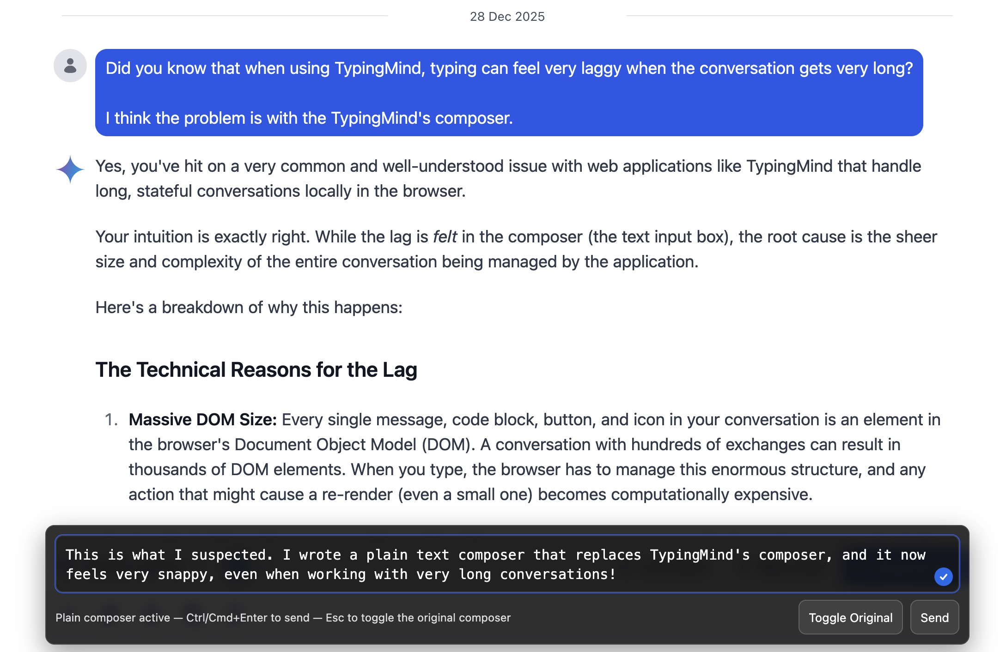

# TypingMind Plain Text Composer (userscript)

**A lightweight userscript for TypingMind that replaces the native rich composer with a plain `<textarea>` overlay for smoother typing** — especially in long chats where the DOM becomes heavy and the original composer starts lagging.

---

## Why this exists

TypingMind’s original message composer is feature-rich and integrates deeply with the app UI.  
However, in long conversations (or when the chat DOM becomes complex), typing can become **noticeably laggy**, for example:

- input latency (characters appear late)
- dropped keystrokes
- slow cursor movement
- pauses during rerenders
- worse behavior on lower-end laptops or with many tabs open

This typically happens because the original composer is tied into the app’s React/Tailwind UI layer and may trigger expensive DOM work and layout/paint operations while typing, especially when the page is also updating message history, toolbars, animations, etc.

---

## What this script does

This userscript provides a **plain text input overlay** that:

✅ feels like typing into a native text editor  
✅ avoids the heavy composer DOM and rerender pipeline  
✅ still sends messages through TypingMind normally (copies text into the real textarea and triggers send)  
✅ keeps your drafts (per chat URL)  
✅ supports autogrow  
✅ supports toggling back to the original composer  
✅ avoids “jitter” during TypingMind hydration by waiting for stable layout before showing  

---

## Screenshot

---

## Features

- **Plain textarea overlay** for fast input
- **Enter inserts a newline**
- **Ctrl/Cmd + Enter to send**
- **Autogrow** (up to a percentage of the viewport height)
- **Per-chat drafts** saved to `localStorage`
- **Draft cleanup** (TTL + maximum number of entries)
- **Esc** toggles the original TypingMind composer
- **“Plain Composer” floating button** appears when the original composer is shown
- **Stable anchoring**
  - stays centered with the TypingMind chat column
  - avoids bouncing during load / React hydration
- **Throttled MutationObserver** for SPA rerenders

---

## Installation

### 1) Install a userscript manager
- Chrome / Chromium: **ViolentMonkey**
- Firefox: **ViolentMonkey**
- (Other managers may work too.)

### 2) Install the script
1. Open the ViolentMonkey dashboard
2. Click **New Script**
3. Paste the content of `typingmind-plain-composer.user.js`
4. Save

### 3) Open TypingMind
Go to:
- https://typingmind.com  
or
- https://www.typingmind.com

The plain composer appears once TypingMind has fully loaded and the layout has stabilized.

---

## Usage

### Typing
- Type normally in the overlay textarea.
- Drafts are saved automatically (per chat URL).

### Sending
- **Ctrl+Enter** (Windows/Linux) or **Cmd+Enter** (macOS)
- Or click **Send**

### Toggling the original composer
- Press **Esc**, or click **Toggle Original**
- When the original composer is visible, a floating button appears:
  - **Plain Composer** → return to the overlay

---

## How it works (high level)

TypingMind’s native composer remains in the DOM, but the script:

1. Waits until the native composer becomes visible at least once (hydration complete)
2. Measures the chat column geometry (`<main>` / scroll container) and the native input container width
3. Creates an overlay textarea
4. Anchors the overlay to the same horizontal region as the chat column
5. Hides the original textarea (default)
6. On send, copies the overlay text into the real TypingMind textarea and triggers send using a sequence of strategies:
   - Ctrl+Enter
   - Cmd+Enter
   - Enter
   - send button click (fallback)

To prevent the overlay from moving around during initial React hydration, the overlay only becomes visible once the layout is stable for several consecutive checks.

---

## Privacy

- Drafts are stored in **your browser’s `localStorage`**, on your machine only.
- Nothing is transmitted by this script.

---

## Configuration

Most settings can be tweaked inside the script in the `CONFIG` object:

- width cap (fallback)
- autogrow min height and max viewport height
- draft retention (TTL, max entries)
- debounce timings
- mutation observer throttling
- send strategy preferences
- stability gating settings

---

## Compatibility

### Userscript managers

This script is written as a standard userscript and does not rely on special APIs (`@grant none`), so it should work in most common managers:

- ✅ ViolentMonkey (tested)
- ✅ Tampermonkey (expected to work)
- ✅ Greasemonkey (expected to work on Firefox)
- ✅ Safari Userscripts (tested)

### TypingMind (SPA)

TypingMind is a single-page app (SPA), so the script uses a MutationObserver + periodic checks to reattach after rerenders.

Some browsers/userscript managers may handle synthetic keyboard events differently. The script includes multiple send strategies (Ctrl/Cmd+Enter, Enter, and a send button click fallback) to maximize compatibility.

---

## Known limitations

- This is a **plain text** composer: no rich formatting, no fancy editing features.
- If TypingMind changes their DOM structure, the script may require updates.
- Some environments may block synthetic keyboard events; send fallback strategies are included, but edge cases are possible.

---

## Troubleshooting

### The overlay does not show up
- Make sure the script is enabled in ViolentMonkey.
- Hard refresh TypingMind (**Ctrl+Shift+R** / **Cmd+Shift+R**).
- Open DevTools → Console and look for logs starting with:
  - `[TMPlainComposer]`

### Sending doesn’t work
TypingMind setups may differ (Enter-to-send vs Ctrl+Enter).  
You can adjust the send strategy options in the script:

- `trySendViaCtrlEnter`
- `trySendViaMetaEnter`
- `trySendViaPlainEnter`
- `trySendViaSendButton`

---

## Uninstall

1. Disable or remove the script in your userscript manager.
2. (Optional) Clear saved drafts from `localStorage`:
   - search for keys starting with `vm_tm_plain_composer_draft:`.

---

## Contributing

PRs and improvements are welcome!

If TypingMind changes their DOM and the script breaks, please open an issue and include:

- browser + version
- userscript manager + version
- whether sending works via hotkey vs send button
- console logs starting with `[TMPlainComposer]`
- (optional) HTML snippet around the composer (`#chat-input-textbox`)

---

## License

This project is licensed under the MIT License. See the [LICENSE](LICENSE) file for details.

